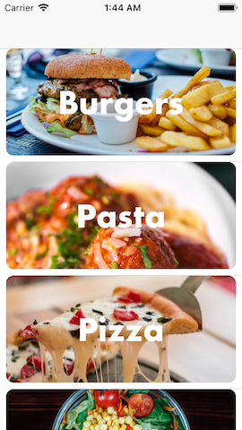
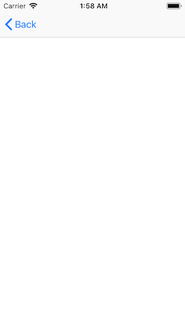
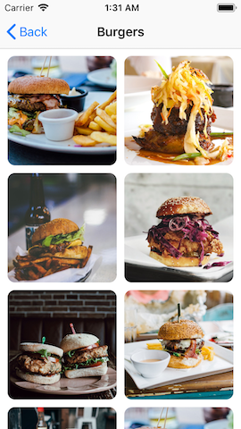
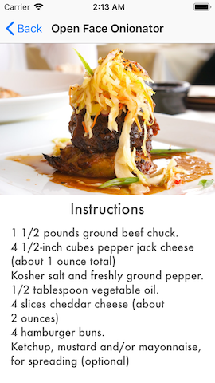

# Recipe App

## Description
Recipe App
### features/implementing-tableview
| Screenshot 1 |
| ------------ |
|  |

### features/passing-data-in-prepare-for-segue
| Screenshot 1 |
| ------------ |
|  |

### features/setting-up-collection-view
| Screenshot 1 |
| ------------ |
|  |

### features/recipe-detail-view
| Screenshot 1 |
| ------------ |
|  |
